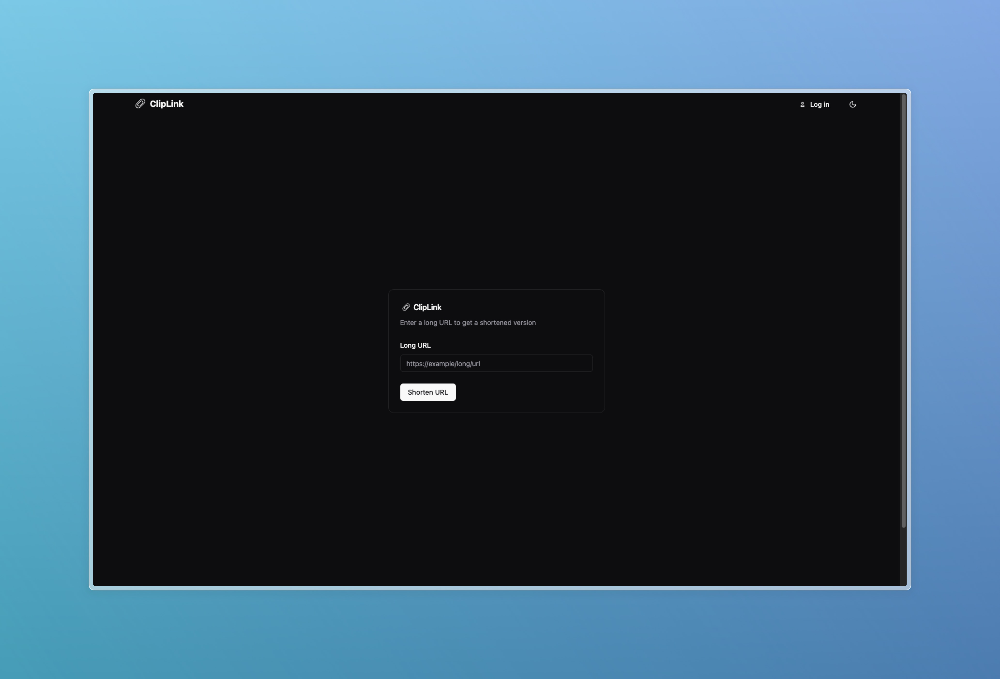

<a id="readme-top"></a>

![Unlicense License][license-shield]
[![LinkedIn][linkedin-shield]][linkedin-url]


<!-- PROJECT LOGO -->
<br />
<div align="center">
  <a href="https://cliplink.app" target="_blank">
    
  </a>

  <h3 align="center">ClipLink - URL Shortener</h3>

  <p align="center">
    The ultimate URL shortener for seamless link management. Shorten, customize, and track your links with ease. Boost your branding and analytics with a fast, reliable, and user-friendly solution. Try ClipLink today!
    <br />
    <a href="https://cliplink.app"><strong>Explore the site »</strong></a>
  </p>
</div>

<!-- TABLE OF CONTENTS -->
<details>
  <summary>Table of Contents</summary>
  <ol>
    <li>
      <a href="#about-the-project">About The Project</a>
      <ul>
        <li><a href="#built-with">Built With</a></li>
      </ul>
    </li>
    <li>
      <a href="#getting-started">Getting Started</a>
      <ul>
        <li><a href="#prerequisites">Prerequisites</a></li>
        <li><a href="#installation">Installation</a></li>
      </ul>
    </li>
    <li><a href="#license">License</a></li>
    <li><a href="#contact">Contact</a></li>
  </ol>
</details>


<!-- ABOUT THE PROJECT -->
## About The Project

<div align="center">
  <a href="https://github.com/ososuna/cliplink-ui.git" target="_blank">
    
  </a>
</div>

ClipLink is a minimalistic, high-performance URL shortener designed with usability at its core. Whether you're managing a large number of links or just need a quick way to create short, shareable URLs, ClipLink makes it simple and efficient.

#### Key features:
* Minimalistic Design: Clean and intuitive interface ensures an effortless user experience.
* Third-party authentication: Google and Github authentication.
* Blazing Fast Performance: Optimized backend and frontend deliver instant results.
* Customizable Links: Personalize your short URLs to make them memorable.
* Scalable Architecture: Built to handle growing demands without compromising speed.

#### Why Choose ClipLink?

ClipLink was crafted with simplicity and performance in mind, making it the perfect tool for users who value ease of use and speed without unnecessary bloat.

<p align="right">(<a href="#readme-top">back to top</a>)</p>

### Built With
* [![Astro][Astro]][Astro-url]
* [![React][React.js]][React-url]
* [![shadcn][shadcn]][shadcn-url]
* [![TailwindCSS][TailwindCSS]][TailwindCSS-url]
* [![Vercel][Vercel]][Vercel-url]
* [![Render][Render]][Render-url]
* [![Express.js][Express.js]][Express-url]
* [![MongoDB][MongoDB]][MongoDB-url]


<p align="right">(<a href="#readme-top">back to top</a>)</p>


<!-- GETTING STARTED -->
## Getting Started

Follow these steps to clone and set up the ClipLink URL Shortener on your local machine:

### Prerequisites

Ensure you have the following installed:
1. [Node.js](https://nodejs.org/) (version 16 or higher recommended)  
2. [pnpm](https://pnpm.io/), [npm](https://www.npmjs.com/) or [yarn](https://yarnpkg.com/) package manager


### Installation

1. Start the ClipLink Rest API following the next instructions: [https://github.com/ososuna/cliplink-rest?tab=readme-ov-file#getting-started](https://github.com/ososuna/cliplink-rest?tab=readme-ov-file#getting-started)

2. Clone the repo
   ```sh
   git clone https://github.com/ososuna/cliplink-ui.git
   ```
3. Install NPM packages
    #### Using pnpm
    ```bash
    pnpm install
    ```
    #### Using npm
    ```bash
    npm install
    ```
    #### Using yarn
    ```bash
    yarn
    ```
4. Create a .env file in the root of the project and enter your own environment variables
   ```.env
    PUBLIC_API_BASE_URL=
    PUBLIC_API_DOMAIN=
    PUBLIC_APP_NAME=
   ```
5. Change git remote url to avoid accidental pushes to base project
   ```sh
   git remote set-url origin github_username/repo_name
   git remote -v # confirm the changes
   ```
6. Start the Development server
    #### Using pnpm
    ```bash
    pnpm run dev
    ```
    #### Using npm
    ```bash
    npm run dev
    ```
    #### Using yarn
    ```bash
    yarn dev
    ```

<p align="right">(<a href="#readme-top">back to top</a>)</p>

<!-- LICENSE -->
## License

Distributed under the Unlicense License.

<p align="right">(<a href="#readme-top">back to top</a>)</p>

<!-- CONTACT -->
## Contact

[Oswaldo Osuna](https://oswaldo-osuna.com) - oswaldo.adrian35@gmail.com

Project Link: [https://github.com/ososuna/cliplink-ui.git](https://github.com/ososuna/cliplink-ui.git)

<p align="right">(<a href="#readme-top">back to top</a>)</p>

<!-- MARKDOWN LINKS & IMAGES -->
<!-- https://www.markdownguide.org/basic-syntax/#reference-style-links -->
[contributors-shield]: https://img.shields.io/github/contributors/othneildrew/Best-README-Template.svg?style=for-the-badge
[contributors-url]: https://github.com/othneildrew/Best-README-Template/graphs/contributors
[forks-shield]: https://img.shields.io/github/forks/othneildrew/Best-README-Template.svg?style=for-the-badge
[forks-url]: https://github.com/othneildrew/Best-README-Template/network/members
[stars-shield]: https://img.shields.io/github/stars/othneildrew/Best-README-Template.svg?style=for-the-badge
[stars-url]: https://github.com/othneildrew/Best-README-Template/stargazers
[issues-shield]: https://img.shields.io/github/issues/othneildrew/Best-README-Template.svg?style=for-the-badge
[issues-url]: https://github.com/othneildrew/Best-README-Template/issues
[license-shield]: https://img.shields.io/github/license/othneildrew/Best-README-Template.svg?style=for-the-badge
[license-url]: https://github.com/othneildrew/Best-README-Template/blob/master/LICENSE.txt
[linkedin-shield]: https://img.shields.io/badge/-LinkedIn-black.svg?style=for-the-badge&logo=linkedin&colorB=555
[linkedin-url]: https://www.linkedin.com/in/ososuna/
[product-screenshot]: images/screenshot.png
[Next.js]: https://img.shields.io/badge/next.js-000000?style=for-the-badge&logo=nextdotjs&logoColor=white
[Next-url]: https://nextjs.org/
[React.js]: https://img.shields.io/badge/React-20232A?style=for-the-badge&logo=react&logoColor=61DAFB
[React-url]: https://reactjs.org/
[Vue.js]: https://img.shields.io/badge/Vue.js-35495E?style=for-the-badge&logo=vuedotjs&logoColor=4FC08D
[Vue-url]: https://vuejs.org/
[Angular.io]: https://img.shields.io/badge/Angular-DD0031?style=for-the-badge&logo=angular&logoColor=white
[Angular-url]: https://angular.io/
[Svelte.dev]: https://img.shields.io/badge/Svelte-4A4A55?style=for-the-badge&logo=svelte&logoColor=FF3E00
[Svelte-url]: https://svelte.dev/
[Laravel.com]: https://img.shields.io/badge/Laravel-FF2D20?style=for-the-badge&logo=laravel&logoColor=white
[Laravel-url]: https://laravel.com
[Bootstrap.com]: https://img.shields.io/badge/Bootstrap-563D7C?style=for-the-badge&logo=bootstrap&logoColor=white
[Bootstrap-url]: https://getbootstrap.com
[JQuery.com]: https://img.shields.io/badge/jQuery-0769AD?style=for-the-badge&logo=jquery&logoColor=white
[JQuery-url]: https://jquery.com 
[Astro]: https://img.shields.io/badge/Astro-FF5D01?style=for-the-badge&logo=astro&logoColor=white
[Astro-url]: https://astro.build/
[shadcn]: https://img.shields.io/badge/shadcn-0EA5E9?style=for-the-badge&logo=tailwindcss&logoColor=white
[shadcn-url]: https://ui.shadcn.com
[TailwindCSS]: https://img.shields.io/badge/Tailwind_CSS-38B2AC?style=for-the-badge&logo=tailwindcss&logoColor=white
[TailwindCSS-url]: https://tailwindcss.com/
[Vercel]: https://img.shields.io/badge/Vercel-000000?style=for-the-badge&logo=vercel&logoColor=white
[Vercel-url]: https://vercel.com/
[Render]: https://img.shields.io/badge/Render-0095D5?style=for-the-badge&logo=render&logoColor=white
[Render-url]: https://render.com/
[MongoDB]: https://img.shields.io/badge/MongoDB-47A248?style=for-the-badge&logo=mongodb&logoColor=white
[MongoDB-url]: https://www.mongodb.com/
[MongoDB]: https://img.shields.io/badge/MongoDB-47A248?style=for-the-badge&logo=mongodb&logoColor=white
[MongoDB-url]: https://www.mongodb.com/
[Express.js]: https://img.shields.io/badge/Express.js-000000?style=for-the-badge&logo=express&logoColor=white
[Express-url]: https://expressjs.com/
